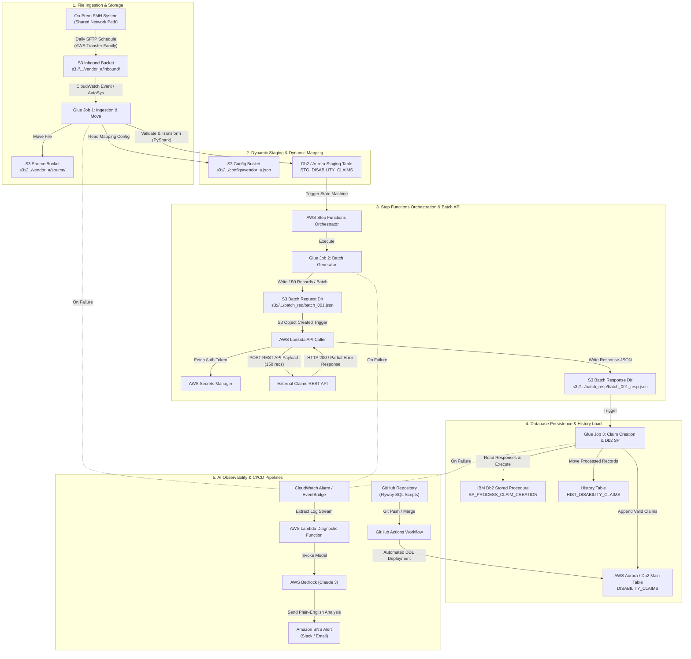

# Enterprise Claims ETL Pipeline – Architecture & Functional Flowchart

**Project**: Prudential Financial Data Platform Modernization  
**Author**: Devansh Jha (Data Engineer, Cognizant)  

---

## 1. Visual System Architecture Diagram

---

## 2. Detailed Step-by-Step Functional Walkthrough

### Step 1: File Ingestion via AWS Transfer Family (SFTP)
- **Technology**: AWS Transfer Family, SFTP, Amazon S3
- **Input**: Raw multi-vendor data file (CSV, XLSX, ZIP, DAT) deposited by the FMH team from their on-premise shared network path.
- **Output Path**: `s3://prudential-data-lake-prod/vendor_a/inbound/`

### Step 2: Job Initialization & Inbound-to-Source File Movement
- **Technology**: AWS Glue (PySpark), Boto3, S3
- **Functionality**: Triggered by AutoSys/CloudWatch Events with `category=stageload`, `vendor_id=VENDOR_A`. Moves inbound file to `source/` folder to prevent re-triggering.
- **Destination**: `s3://prudential-data-lake-prod/vendor_a/source/`

### Step 3: Dynamic JSON Config Fetching & Schema Resolution
- **Technology**: PySpark, JSON, Amazon S3
- **Functionality**: Reads `s3://.../configs/vendor_a_claims_config.json`. Loads target column names, data types, date formats (`yyyy-MM-dd`), delimiters, and staging table names dynamically. Enables onboarding new vendors with zero code changes.

### Step 4: PySpark Transformation & Staging Write
- **Technology**: PySpark SQL, JDBC, IBM Db2 / AWS Aurora
- **Functionality**: Casts data types, formats dates, filters invalid rows, and appends records into `STG_DISABILITY_CLAIMS` via JDBC with database credentials fetched from AWS Secrets Manager.

### Step 5: Step Functions State Machine Trigger
- **Technology**: AWS Step Functions
- **Functionality**: Orchestrates sequential batch generation, API calls, error retries (exponential backoff), and database creation jobs.

### Step 6: Batch Generation (150 Records / Batch)
- **Technology**: PySpark Glue Job 2, Amazon S3
- **Functionality**: Reads staged records from `STG_DISABILITY_CLAIMS`, partitions records into chunks of **150 records per batch**, and writes JSON payloads to `s3://.../vendor_a/batch_req/batch_001.json`.

### Step 7: AWS Lambda REST API Invocation
- **Technology**: AWS Lambda (Python), AWS Secrets Manager, REST API
- **Functionality**: Triggered by S3 object creation in `batch_req/`. Retrieves API Auth Token from Secrets Manager, POSTs 150-record JSON payload to Claims REST API.

### Step 8: Partial-Success Response Parsing & S3 Persistence
- **Technology**: AWS Lambda, Amazon S3
- **Functionality**: Parses API response per claim. Successful claims (with assigned `Control Number` & `Claim ID`) and failed claims are separated into JSON arrays and written to `s3://.../vendor_a/batch_resp/batch_001_resp.json`.

### Step 9: Db2 Stored Procedure Execution & Aurora Table Writes
- **Technology**: PySpark Glue Job 3, JDBC, IBM Db2, AWS Aurora
- **Functionality**: Reads API response JSONs from `batch_resp/`. Connects to Db2/Aurora via JDBC, executes reworked Db2 Stored Procedure (`SP_PROCESS_CLAIM_CREATION`), and inserts valid claims into `DISABILITY_CLAIMS` main table.

### Step 10: History Load & Idempotent Cleanup
- **Technology**: PySpark, Db2/Aurora, S3 Boto3
- **Functionality**: Moves processed stage records to `HIST_DISABILITY_CLAIMS` table along with `batch_id` and timestamp. Moves source files to `archive/` folder. Ensures **idempotent execution** (reruns produce zero duplicate records).

### Step 11: AWS Bedrock AI Diagnostics (On Failure)
- **Technology**: EventBridge, AWS Lambda, AWS Bedrock (Claude 3), Amazon SNS
- **Functionality**: On pipeline failure, EventBridge triggers Lambda to fetch CloudWatch log stream and pass it to Bedrock. Bedrock generates a plain-English 3-bullet alert (Root Cause, Affected S3 Path, Recommended Fix) sent via SNS.

### Step 12: Flyway & GitHub Actions Database CI/CD Pipeline
- **Technology**: Flyway, GitHub Actions, SQL, AWS Aurora / Db2
- **Functionality**: All DDL and stored procedure updates are version-controlled in Flyway repository. Merging to `feature` branch deploys Flyway migrations to **Dev DB**; merging to `sandbox` branch deploys Flyway migrations to **QA DB**.

---
*Created for Devansh Jha — Data Engineer | Prudential Financial Modernization Program*
